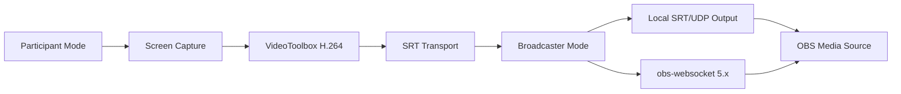

# Architecture

Transport implementations are intentionally isolated:

- `SrtTransport`: v0.1.0 target through FFmpeg/libsrt
- `WebRtcTransport`: future internet-friendly option
- `QuicTransport`: future low-latency option

The desktop UI never builds shell command strings. It sends structured requests to Rust, and Rust generates validated FFmpeg argument arrays.
